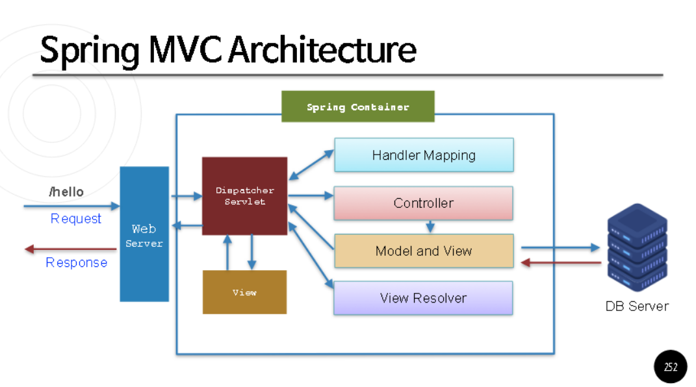

Dispatcher Servlet
중앙 컨트롤러 역할을 하는 서블릿으로, 모든 HTTP 요청을 처리한다.
클라이언트 요청이 들어오면 이를 적절한 핸들러(Controller)로 전달하고, 처리 결과를 View로 연결한다.
Spring MVC의 핵심 구성 요소로, 다른 컴포넌트 간의 조정 역할을 한다.
작동 방식:

HTTP 요청 수신
1.요청 URL에 따라 적절한 핸들러를 찾기 위해 Handler Mapping 호출
2.핸들러(Controller)에 요청 전달
3.Controller의 처리 결과를 Model and View 형태로 받음
4.View Resolver를 통해 적합한 View 결정
5.View에 데이터를 전달하고 최종적으로 클라이언트에게 응답

